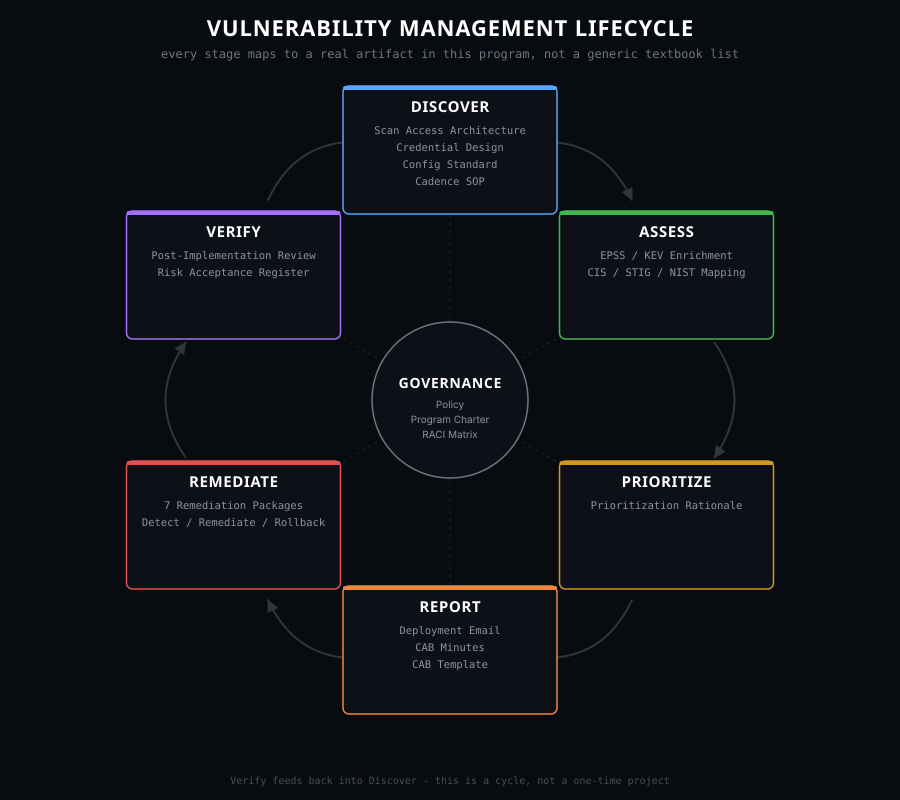
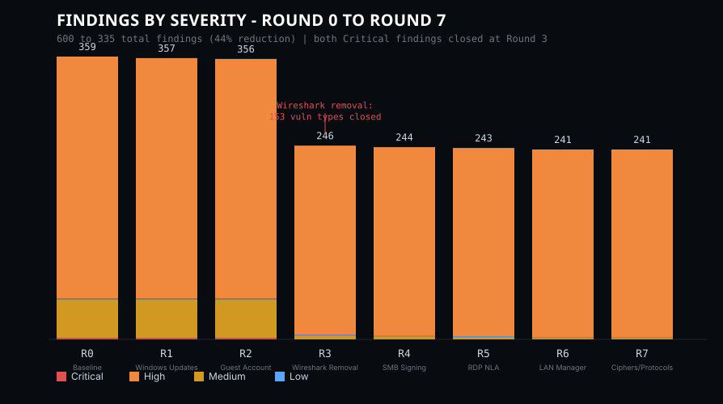

# Vulnerability Management Program — LogN Pacific

A full vulnerability management program, documented end to end: scan access
design, credential lifecycle, prioritization rationale, remediation
packages, change governance, and post-implementation review — built around
eight rounds of real, credentialed Nessus scan data across a 200-server
Windows Server 2025 estate.

## The Lifecycle

Every document in this repo belongs to one stage of the actual VM lifecycle
below, not an arbitrary chapter list. Governance sits in the center because
policy, program charter, and RACI apply across every stage, not as a step
of their own.

## Program Results

- **600 → 335 findings** (44% reduction) across 8 scan rounds
- **Both Critical-severity findings resolved** in a single round — removing
  one unauthorized application (Wireshark/WinPcap) closed 153 distinct
  vulnerability types, more than the other six remediations combined
- **CIS Benchmark compliance:** 27.7% → 28.3% across three real checkpoints
- One finding formally **risk-accepted** rather than silently left open (see
  `06-verify/`) — a 100% remediation rate would read as staged

## Repository Structure

| Folder | Stage | Contents |
|---|---|---|
| `00-governance/` | Governance | Policy, Program Charter, RACI Matrix |
| `01-discover/` | Discover | Scan access architecture, credential design, scan config standard, cadence SOP |
| `02-assess/` | Assess | EPSS/KEV enrichment, CIS/STIG/NIST framework mapping |
| `03-prioritize/` | Prioritize | Ranked remediation order with rationale |
| `04-report/` | Report | Deployment communications, CAB minutes, change request template |
| `05-remediate/` | Remediate | All 7 remediation packages (detect/remediate/rollback) |
| `06-verify/` | Verify | Post-implementation review, risk acceptance register |
| `diagrams/` | — | Lifecycle diagram, trend chart, architecture diagram |
| `evidence/` | — | Real scan result screenshots (Round 0, 3, 7) |

## Worth Reading First

Three things in here are more interesting than a clean success story, and
worth pointing to directly:

- **`02-assess/Framework-Mapping-CIS-STIG-NIST.md`** — the RDP NLA
  remediation passes its Nessus vulnerability check but fails its CIS
  Benchmark check at every audit checkpoint, including after the fix. The
  gap is explained, not hidden: a local registry edit vs. a policy-enforced
  one.
- **`04-report/CAB-Minutes-and-Change-Record.md`** — one change (SCHANNEL
  protocol/cipher hardening) produced zero measurable movement in the
  scanner's finding count. The measurement method was agreed *before*
  deployment, so the null result was a predicted outcome, not an explained
  failure after the fact.
- **`06-verify/Post-Implementation-Review.md`** — writing an honest review
  of the program's own results surfaced a real measurement gap: SLA
  compliance isn't actually calculable without per-finding timestamps that
  weren't captured. Flagged as a process gap, not papered over.
